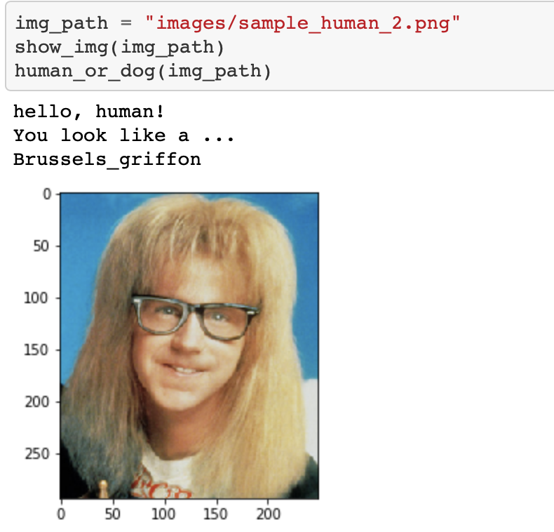

# Data Scientist Nanodegree

# Convolutional Neural Networks

# Project: Write an Algorithm for a Dog Identification App

# Project Overview

If you are looking for a more guided capstone project related to deep learning and convolutional neural networks, this might be just it. The goal is to classify images of dogs according to their breed, developing an algorithm that could be used as part of a mobile or web app. If a dog is detected in the image, it will provide an estimate of the dog's breed. If a human is detected, it will provide an estimate of the dog breed that is most resembling. 

# project motivation

i've completed several guided projects, and now's my chance to show off your skills and creativityIn this capstone project, i will leverage what i’ve learned throughout the program to build a data science project.
 
# The Road Ahead

We break the notebook into separate steps.  Feel free to use the links below to navigate the notebook.

* [Step 0](#step0): Import Datasets
* [Step 1](#step1): Detect Humans
* [Step 2](#step2): Detect Dogs
* [Step 3](#step3): Create a CNN to Classify Dog Breeds (from Scratch)
* [Step 4](#step4): Use a CNN to Classify Dog Breeds (using Transfer Learning)
* [Step 5](#step5): Create a CNN to Classify Dog Breeds (using Transfer Learning)
* [Step 6](#step6): Write your Algorithm
* [Step 7](#step7): Test Your Algorithm

# Instructions

If you want to run this code on your local computer, you'll also need to download the following;

[Dog dataset](https://s3-us-west-1.amazonaws.com/udacity-aind/dog-project/dogImages.zip). Unzip the folder and place it in the repo, at location path/to/dog-project/dogImages.

[Human dataset](https://s3-us-west-1.amazonaws.com/udacity-aind/dog-project/lfw.zip). Unzip the folder and place it in the repo, at location path/to/dog-project/lfw. If you are using a Windows machine, you are encouraged to use 7zip to extract the folder.

[VGG-16 bottleneck](https://s3-us-west-1.amazonaws.com/udacity-aind/dog-project/DogVGG16Data.npz) features for the dog dataset. Place it in the repo, at location path/to/dog-project/bottleneck_features.

[VGG-19 bottleneck features](https://s3-us-west-1.amazonaws.com/udacity-aind/dog-project/DogVGG19Data.npz) for the dog dataset. Place it in the repo, at location path/to/dog-project/bottleneck_features.

[ResNet-50 bottleneck features](https://s3-us-west-1.amazonaws.com/udacity-aind/dog-project/DogResnet50Data.npz) for the dog dataset. Place it in the repo, at location path/to/dog-project/bottleneck_features.

[Inception bottleneck features](https://s3-us-west-1.amazonaws.com/udacity-aind/dog-project/DogInceptionV3Data.npz) for the dog dataset. Place it in the repo, at location path/to/dog-project/bottleneck_features.

[Xception bottleneck](https://s3-us-west-1.amazonaws.com/udacity-aind/dog-project/DogXceptionData.npz) features for the dog dataset. Place it in the repo, at location path/to/dog-project/bottleneck_features

I recommend setting up an environment for this project to ensure you have the proper versions of the required libraries.

# Install

For Mac/OSX:

	conda env create -f requirements/aind-dog-mac.yml
	source activate aind-dog
	KERAS_BACKEND=tensorflow python -c "from keras import backend"
For Linux:

	conda env create -f requirements/aind-dog-linux.yml
	source activate aind-dog
	KERAS_BACKEND=tensorflow python -c "from keras import backend"
For Windows:

	conda env create -f requirements/aind-dog-windows.yml
	activate aind-dog
	set KERAS_BACKEND=tensorflow
	python -c "from keras import backend"
 
This project requires Python 3 and the following Python libraries installed:

NumPy

Pandas

matplotlib

scikit-learn

keras

OpenCV

Matplotlib

Scipy

Tqdm

Pillow

Tensorflow

Skimage

IPython Kernel

You will also need to have software installed to run and execute an iPython Notebook

I recommend you install Anaconda, a pre-packaged Python distribution that contains all of the necessary libraries and software for this project

# file descriptions

there is dog_app.ipynb where the possible solution will found.

there is bottleneck_features when you Pick one of the above architectures, download the corresponding bottleneck features, and store the downloaded file in the bottleneck_features/ folder in the repository.

there is images where you will find the images to test your algorithm . Feel free to use any images you like. Use at least two human and two dog images.

there is saved_models where you will find the models those i worked on

# improvements section 

Create a CNN to Classify Dog Breeds (from Scratch)

i create CNN from scratch and i use using transfer learning to train a CNN , **with test accuracy of 6.1005 %.**

Our three first layers is Conv2D layers. convolution layers that will deal with our input images, which are seen as 2-dimensional matrices. their number of filters 16,32,64 is the number of nodes, Kernel size is the size of the filter matrix for our convolution.So a kernel size of 2 means we will have a 2x2 filter matrix or feature detector.Padding is used on the convolutional layers to ensure the height and width of the output feature maps matches the inputs. The activation function we will be using for our layers is the ReLU Rectifier Linear Unit which helps with non linearity in the neural network. Our first layer also takes in an input shape.This is the shape of each input image, 224, 224, 3
And between these layers I added a Max Pooling Layer. we apply max pooling for translational invariance. Translational invariance is when we change the input by a small amount the outputs do not change. Max pooling reduces the number of cells. Pooling helps detect features like colors, edges etc. For max pooling, we use the pool_size of 2 by 2 matrix for all 32 feature maps.
After that, there is a "Flatten" layer. Flatten serves as a connection between the convolution and dense layers.step is to flatten all the inputs. The flattened data will be the input to the fully connected neural network.
'Dense’ is the layer type we will use in for our output layer. Dense is a standard layer type that is used in many cases for neural networks.
we use Dropout rate of 20% to prevent overfitting.
The activation is ‘softmax’. Softmax makes the output sum up to 1 so the output can be interpreted as probabilities. The model will then make its prediction based on which option has the highest probability.

use a CNN to Classify Dog Breeds (using Transfer Learning)

i Use a CNN to Classify Dog Breeds from pre-trained VGG-16 model **with test accuracy: 40.9091%.**

The model uses the the pre-trained VGG-16 model as a fixed feature extractor, where the last convolutional output of VGG-16 is fed as input to our model.i only add a global average pooling layer and a fully connected layer, where the latter contains one node for each dog category and is equipped with a softmax.

Create a CNN to Classify Dog Breeds (using Transfer Learning)

then i use transfer learning to create a CNN that can identify dog breed from images. **with 80% accuracy on the test set.**

I used the CNN architecture with the Resnet50 bottleneck and adding the GlobalAveragePooling2D to flatten the features into a vector that could be fed into a fully-connected layer to the end of the ResNet50 model.where the fully -connected layer contains one node for each dog category and is equipped with a softmax.

i **suggest** the output could be better if we do ;

1_if we use more data and [Augment](https://blog.keras.io/building-powerful-image-classification-models-using-very-little-data.html) the Training Data 

In order to make the most of our few training examples, we will "augment" them via a number of random transformations, so that our model would never see twice the exact same picture. This helps prevent overfitting and helps the model generalize better.

in Keras this can be done via the keras.preprocessing.image.ImageDataGenerator class. This class allows you to:

configure random transformations and normalization operations to be done on your image data during training
instantiate generators of augmented image batches (and their labels) via .flow(data, labels) or .flow_from_directory(directory). These generators can then be used with the Keras model methods that accept data generators as inputs, fit_generator, evaluate_generator and predict_generator. 
rotation_range is a value in degrees (0-180), a range within which to randomly rotate pictures
width_shift and height_shift are ranges (as a fraction of total width or height) within which to randomly translate pictures vertically or horizontally
rescale is a value by which we will multiply the data before any other processing. Our original images consist in RGB coefficients in the 0-255, but such values would be too high for our models to process (given a typical learning rate), so we target values between 0 and 1 instead by scaling with a 1/255. factor.
shear_range is for randomly applying shearing transformations
zoom_range is for randomly zooming inside pictures
horizontal_flip is for randomly flipping half of the images horizontally --relevant when there are no assumptions of horizontal assymetry (e.g. real-world pictures).
fill_mode is the strategy used for filling in newly created pixels, which can appear after a rotation or a width/height shift.

2_if we add more epochs in the training process but here we can't add more cause more parameters means longer training
3_if we use more layers of the neural network 

# result section 

I used the 'transfer learning - Resnet50 model' to implement an algorithm for a Dog identification application. The user provides an image, and the algorithm first detects whether the image is human or dog. If it is a dog, it predicts the breed. If it is a human, it returns the resembling dog breed.where the model produced the test accuracy of around 80%. 
Here are examples of the algorithms:

# A blog post

